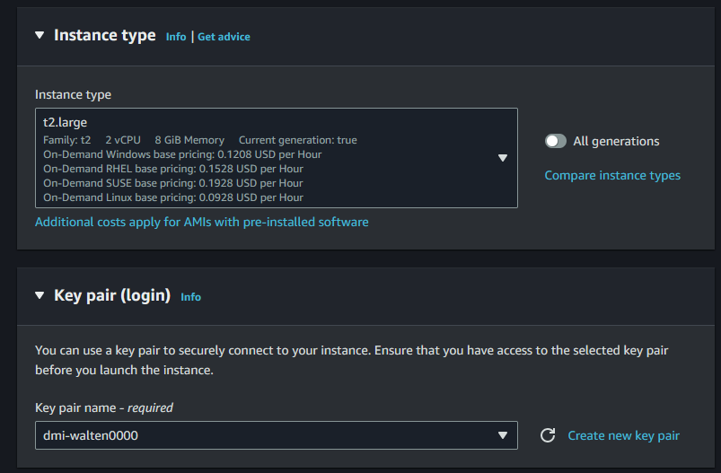

# Finhub stock estimator

The Finnhub Stock Estimator (FSE) is a data pipeline that utilizes a selected subset of stock prices from the S&P 500 index, obtained from Finnhub.io. FSE employs Long Short-Term Memory (LSTM) networks for stock price predictions, followed by visualization on a dashboard.

## Startup


### Start Hadoop

```bash
start-dfs.sh
start-yarn.sh
```

### Start kafka env in terminal 1:
```bash
zookeeper-server-start.sh $KAFKA_HOME/config/zookeeper.properties
```

```bash
kafka-server-start.sh $KAFKA_HOME/config/server.properties 
```

```bash
FinnhubProducer.py
```

### Spark Consumer

First add dependency to avro

```bash
spark-submit --packages org.apache.spark:spark-avro_2.12:3.5.1 org.mongodb.spark:mongo-spark-connector_2.12:10.3.0 org.apache.spark:spark-sql-kafka-0-10_2.12:3.5.1  ./StreamProcessor/stream_processor.py
sudo apt update
```

Download jar and add manually
```bash
spark-submit --packages  org.apache.spark:spark-sql-kafka-0-10_2.12:3.5.1 --jars ./jars/spark-avro_2.12-3.5.1.jar  ./StreamProcessor/stream_processor.py
```

Start the collector
```bash
spark-submit --packages ./StreamProcessor/collector.py
```

### Mongo DB

```bash
sudo systemctl start mongod
```

### Start the model

```bash
spark-submit ./StreamProcessor/estimator-kafka.py
```

### Start the Streamlit website

```bash
streamlit run ./dashboard/app.py
```


## Setup & deployment

For setup, one have to perform the following sequence;

1. Setup the AWS EC2 instances.
2. Install Java.
3. Install Python.
4. Install Hadoop with YARN.
5. Install Kafka.
6. Install Spark.
7. Install MongoDb


### Setup the AWS EC2 instances.

First we have to set up elastic IP's to make sure our nodes stay reachable and prevent changing settings.


Then we start with setting up 3 EC2 instances.


Using Ubuntu 24.04.


Using t2.large and adding ssh keys.



Allowing ssh, http and https.


Setting storage to 50GiB.


Creating 3 instances.


3 instances running.


Assigning elastic IP to 3 instances.


#### Setting up Hadoop on EC2

Connecting with ssh to all instances.


```bash
sudo apt-get update
```


On namenode we set up ssh key and copy it to datanodes authorized\_keys.

```bash
sudo apt-get install ssh
```

```bash
ssh-keygen -t rsa -P '' -f ~/.ssh/id_rsa
```

```bash
cat .ssh/id_rsa.pub >> ~/.ssh/authorized_keys
```


We set up \verb|etc/hosts| on all 3 instances


We install java and set the JAVA\_HOME variable.

```bash
sudo apt-get -y install openjdk-8-jdk-headless
export JAVA_HOME=/usr/lib/jvm/java-8-openjdk-amd64
```


We download and setup hadoop with.

```
wget https://archive.apache.org/dist/hadoop/common/hadoop-3.1.1/hadoop-3.1.1.tar.gz
tar -xzf hadoop-3.1.1.tar.gz
```

```
vi ~/.bashrc
export HADOOP_HOME=/home/ubuntu/hadoop
export PATH=$PATH:$HADOOP_HOME/bin
export PATH=$PATH:$HADOOP_HOME/sbin
export HADOOP_MAPRED_HOME=${HADOOP_HOME}
export HADOOP_COMMON_HOME=${HADOOP_HOME}
export HADOOP_HDFS_HOME=${HADOOP_HOME}
export YARN_HOME=${HADOOP_HOME}
```

```bash
source ~/.bashrc
```


We configure the following files in hadoop config. (The config files are attached under /config/)
```bash
vi ~/hadoop/etc/hadoop/hadoop-env.sh
vi ~/hadoop/etc/hadoop/hadoop-env.sh
vi ~/hadoop/etc/hadoop/hdfs-site.xml
vi ~/hadoop/etc/hadoop/yarn-site.xml
vi ~/hadoop/etc/hadoop/mapred-site.xml
```

We setup the directoreies
```bash
sudo mkdir -p /usr/local/hadoop/hdfs/data
sudo chown ubuntu:ubuntu -R /usr/local/hadoop/hdfs/data
chmod 700 /usr/local/hadoop/hdfs/data
```


We format the hdfs

```bash
hdfs namenode -format
```

And start the cluster

```bash
start-dfs.sh
start-yarn.sh
```


### Kafka Producer

#### Step 1: You will need kafka:


wget https://www.apache.org/dyn/closer.cgi?path=/kafka/3.7.0/kafka_2.13-3.7.0.tgz
```

#### Step 2: Extract
```bash
tar -xf kafka_2.13-3.7.0.tgz 

```
```bash
 cd kafka_2.13-3.7.0
 ```
 
 sudo mv kafka_2.13-3.7.0 /opt/kafka
 
 #### Step 6: Configure Environment Variables

```bash
nano ~/.bashrc
```

Add the following lines at the end of the file:

```bash

export KAFKA_HOME=/opt/kafka
export PATH=$PATH:$KAFKA_HOME/bin
```

```bash
source ~/.bashrc
```

#### Step 7: Start kafka env in terminal 1:
```bash
zookeeper-server-start.sh $KAFKA_HOME/config/zookeeper.properties
```

#### Step 8: Start kafka server in terminal 2:
```bash
kafka-server-start.sh $KAFKA_HOME/config/server.properties 
```

#### Step 9: you can just start the  snd see the data
```bash
FinnhubProducer.py
```


#### Step 9: you can just start the  snd see the data

```bash
FinnhubProducer.py
```


#### Step 10: To see if its properly saving to kafka use this:
```bash
kafka-console-consumer.sh --bootstrap-server localhost:9092 --topic market --from-beginning
```


### Spark
To run Spark on your local machine you need to have Java and Spark installed. You can download Spark from the official website: https://spark.apache.org/downloads.html. After downloading Spark, you need to extract the files and set the environment variables. You can set the environment variables in the .bashrc file. You can open the .bashrc file using the following command:

#### Step 1: Update System Packages

```bash
sudo apt update
```

#### Step 2: Install Java

```bash
sudo apt install default-jdk
```

#### Step 3: Download Spark

```bash
wget wget https://dlcdn.apache.org/spark/spark-3.4.0/spark-3.4.0-bin-hadoop3.tgz
```

#### Step 4: Extract the Apache Spark Package
```bash
tar -xvf spark-3.5.1-bin-hadoop3.tgz t/spark
```

### Step 5: Move the Spark Directory


```bash
sudo mv /opt/spark /opt/spark_3.5.1
```

```bash
sudo mv /opt/spark_3.5.1 /opt/spark 
```

```bash
sudo mv spark-3.4.3-bin-hadoop3 /opt/spark
```


#### Step 6: Configure Environment Variables

```bash
nano ~/.bashrc
```

Add the following lines at the end of the file:

```bash
export SPARK_HOME=/opt/spark
export PATH=$PATH:$SPARK_HOME/bin
```
```bash
export SPARK_HOME=/home/ubuntu/spark
export PATH=$PATH:$SPARK_HOME/bin
```

```bash
source ~/.bashrc
```

#### Step 7: Verify the Installation
```bash
spark-shell
```

#### Step 8: Run the HelloWorld.py from then virtual environment
```bash
24/05/13 13:02:47 WARN Utils: Your hostname, ubuntu resolves to a loopback address: 127.0.1.1; using 192.168.245.128 instead (on interface ens33)
24/05/13 13:02:47 WARN Utils: Set SPARK_LOCAL_IP if you need to bind to another address
Setting default log level to "WARN".
To adjust logging level use sc.setLogLevel(newLevel). For SparkR, use setLogLevel(newLevel).
24/05/13 13:02:47 WARN NativeCodeLoader: Unable to load native-hadoop library for your platform... using builtin-java classes where applicable
+----------+---+                                                                
|first_name|age|
+----------+---+
|       sue| 32|
|        li|  3|
|       bob| 75|
|       heo| 13|
+----------+---+
```

#### Step 8: Run the HelloWorld.py from then virtual environment
spark-submit --packages org.apache.spark:spark-avro_2.12:3.5.1 org.mongodb.spark:mongo-spark-connector_2.12:10.3.0 org.apache.spark:spark-sql-kafka-0-10_2.12:3.5.1  ./StreamProcessor/stream_processor.py

#### Step 9: Start the spark consumer

First add dependency to avro

```bash
spark-submit --packages org.apache.spark:spark-avro_2.12:3.5.1 org.mongodb.spark:mongo-spark-connector_2.12:10.3.0 org.apache.spark:spark-sql-kafka-0-10_2.12:3.5.1  ./StreamProcessor/stream_processor.py
sudo apt update
```

Download jar and add manually
```bash
spark-submit --packages  org.apache.spark:spark-sql-kafka-0-10_2.12:3.5.1 --jars ./jars/spark-avro_2.12-3.5.1.jar  ./StreamProcessor/stream_processor.py
```


At the end of the setup your `.basrc`file should look like this.

```bash
export HADOOP_HOME=/home/ubuntu/hadoop
export PATH=$PATH:$HADOOP_HOME/bin
export PATH=$PATH:$HADOOP_HOME/sbin
export HADOOP_MAPRED_HOME=${HADOOP_HOME}
export HADOOP_COMMON_HOME=${HADOOP_HOME}
export HADOOP_HDFS_HOME=${HADOOP_HOME}
export YARN_HOME=${HADOOP_HOME}

export KAFKA_HOME=/opt/kafka
export PATH=$PATH:$KAFKA_HOME/bin

export SPARK_HOME=/opt/spark
export PATH=$PATH:$SPARK_HOME/bin


export SPARK_HOME=/home/ubuntu/spark
export PATH=$PATH:$SPARK_HOME/bin
```

Install Mongo db

```bash
sudo apt-get install -y mongodb-org
```

and start it 
```bash
sudo systemctl start mongod
```